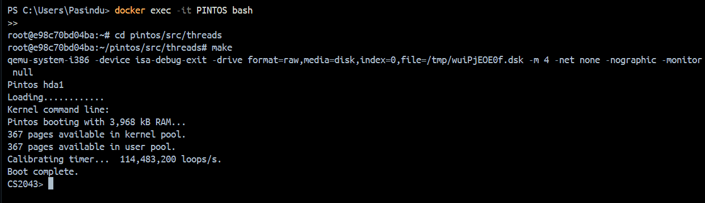
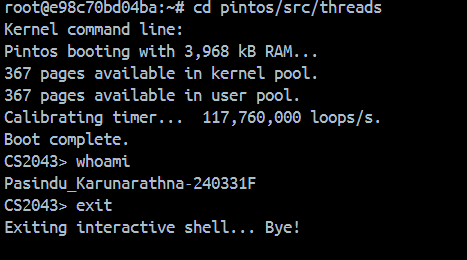
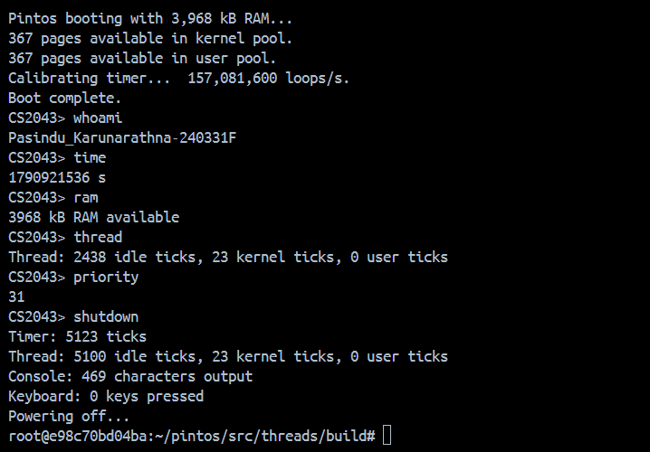

# Project 0: Getting Real

## Preliminaries

>Fill in your name and email address.

Pasindu Karunarathna <Karunarathnapasindu333@gmail.com>

>If you have any preliminary comments on your submission, notes for the TAs, please give them here.

>Please cite any offline or online sources you consulted while preparing your submission, other than the Pintos documentation, course text, lecture notes, and course staff.

## Booting Pintos

>A1: Put the screenshot of Pintos running example here.git 

## Debugging

#### QUESTIONS: BIOS 

>B1: What is the first instruction that gets executed?
jmp 0xf000:e05b

>B2: At which physical address is this instruction located?
'0xffff0'  ---> '16 * 0xf000 + 0xe05b = 0xffff0'

#### QUESTIONS: BOOTLOADER

>B3: How does the bootloader read disk sectors? In particular, what BIOS interrupt is used?
The bootloader reads disk sectors using BIOS interrupt **`INT 0x13`** with `%ah = 0x02` (Read Disk Sectors). It programs register parameters such as sector count, cylinder, head, sector number, and drive ID before invoking the interrupt.

>B4: How does the bootloader decides whether it successfully finds the Pintos kernel?
The bootloader iterates through the MBR partition table (located at offset `0x1be` in the boot sector). It looks for a partition where the bootable flag is set (`0x80`) AND the partition type byte equals **`0x20`** (the designated Pintos kernel partition type).

>B5: What happens when the bootloader could not find the Pintos kernel?
If no partition of type `0x20` is found after scanning all partition entries, the bootloader calls BIOS interrupt `INT 0x18` or prints an error message to the screen and halts execution in an infinite loop.

>B6: At what point and how exactly does the bootloader transfer control to the Pintos kernel?
After loading the kernel ELF image into physical memory starting at `0x20000`, the bootloader parses the ELF header to locate the entry point execution address. It then performs an indirect jump directly to that entry point address (which points to `start()` in `threads/start.S`).

#### QUESTIONS: KERNEL

>B7: At the entry of pintos_init(), what is the value of expression `init_page_dir[pd_no(ptov(0))]` in hexadecimal format?
`0x0` (Page directory entries are uninitialized/zeroed out before page table setup).

>B8: When `palloc_get_page()` is called for the first time,

>> B8.1 what does the call stack look like?
>> `#0  palloc_get_page (flags=PAL_ZERO)`
>> `#1  0xc00203aa in paging_init ()`
>> `#2  0xc0020121 in pintos_init ()`

>> B8.2 what is the return value in hexadecimal format?
>>`0xc0101000`

>> B8.3 what is the value of expression `init_page_dir[pd_no(ptov(0))]` in hexadecimal format?
>>`0x0`

>B9: When palloc_get_page() is called for the third time,

>> B9.1 what does the call stack look like?
>> `#0  palloc_get_page (flags=0)`
>> `#1  0xc0020a11 in thread_create (name=0xc002e1b4 "main", priority=31, function=0xc0020080, aux=0x0)`
>> `#2  0xc0020034 in main ()`

>> B9.2 what is the return value in hexadecimal format?
>> `0xc0103000`

>> B9.3 what is the value of expression `init_page_dir[pd_no(ptov(0))]` in hexadecimal format?
>>>> `0x00102007` (The page table entry mapping virtual memory to physical address page frame with present/user flags set).

## Kernel Monitor

>C1: Put the screenshot of your kernel monitor running example here. (It should show how your kernel shell respond to `whoami`, `exit`, and `other input`.)

#### 

>C2: Explain how you read and write to the console for the kernel monitor.
To read input from the console, `input_getc()` from `devices/input.c` is used in a loop to capture keystrokes sequentially until a newline character (`\n` or `\r`) is detected. Each character is echoed back to the screen using `printf("%c", ch)` or `putchar(ch)` so the user can see what they are typing.

To write output to the console, standard formatting functions like `printf()` from `lib/stdio.c` are used to print strings, prompts (`CS2043>`), command results (such as printing the name for `whoami`), and error messages (`invalid command`).